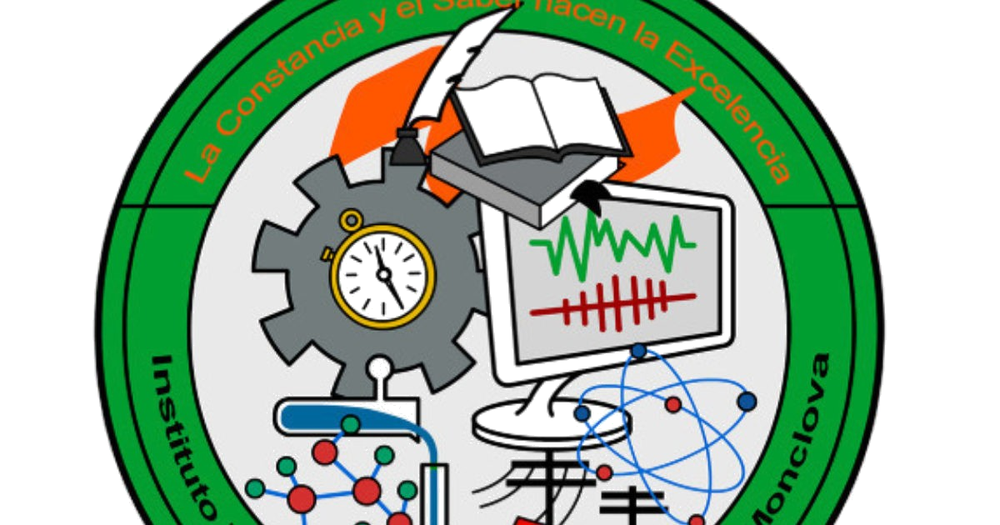

# 🛡️ NeonGuard

**NeonGuard** es un sistema inteligente de monitoreo del sueño infantil que opera en dos modos:

- 🌐 **Modo Internet:** Si hay Wi-Fi, los datos de la pulsera se consultan desde un servidor HTTP.
- 📶 **Modo Local (AP):** Si no hay internet, el sistema activa un Access Point local que espera datos directamente.

Este sistema permite registrar y visualizar en tiempo real los signos vitales de un infante, como el pulso, movimiento y nivel de oxigenación.

---

## 📦 Estructura del Proyecto

```
NeonGuard/
├── NeonGuard.ino
├── WiFiManagerServer.h         # Manejo de conexión Wi-Fi y credenciales
├── InternetAPIServer.h         # Servidor HTTP para modo Internet
├── LocalAPReceiver.h           # Servidor en modo Access Point (modo local)
├── GlobalData.h / .cpp         # Variables compartidas
```

---

## 🧠 Características

- ✅ Auto-conexión a redes Wi-Fi guardadas (WiFiManager)
- 🔁 Cambio automático a red local si no hay internet
- 💾 Detección de 3 reinicios rápidos para borrar credenciales
- 🧪 Recepción de datos vía POST JSON en modo AP
- 🌐 API REST disponible vía `/estado`

---

## 🖼️ Logos

### Instituto Tecnológico Superior de Monclova




### Proyecto NeonGuard


---

## ⚙️ Requisitos

- ESP32 DevKit v1
- Arduino IDE 2.x o VSCode + PlatformIO
- Librerías necesarias:
  - `WiFiManager`
  - `WebServer`
  - `Preferences`
  - `ArduinoJson`

---

## 🔧 Cómo usar

1. Sube el sketch `NeonGuard.ino` a tu ESP32.
2. Si no hay Wi-Fi configurado, se crea una red llamada `NeonGuard_Config`.
3. Ingresa desde tu celular o PC, y configura el Wi-Fi.
4. Si el sistema no detecta internet después de 60 segundos, cambia automáticamente a modo local (Access Point).
5. Si apagas y prendes el dispositivo **3 veces seguidas**, se borrarán las credenciales y reiniciará la configuración.

---

## 📡 API - Modo Internet

- `GET /estado`  
  Devuelve un JSON con el estado actual de la pulsera:

```json
{
  "puls": 78,
  "movimiento": true,
  "oxigenacion": 98
}
```

---

## 🧪 Borrar credenciales manualmente

- Puedes enviar `-1` por el monitor serial para reiniciar la configuración Wi-Fi.
- O apagar/encender la ESP32 3 veces rápidamente para borrado automático.

---

## 👤 Desarolladores

Desarrollado por el equipo de **NeonGuard**  
Instituto Tecnológico Superior de Monclova

### 👨‍💻 Programador

- [Alexander Uriel Torres Pérez](https://www.facebook.com/share/1BvaWjtfng/)

### 🎨 Diseñador y modelador

- [Luis Ángel Córdova Ceniceros](https://www.facebook.com/luis.cordova.79462815)

### 🔌 Eléctrico

- [Pablo Emiliano Sánchez Campos](https://www.facebook.com/pablo.sanchez.251275)

### 👩‍💼 Administradoras

- [Aranza Dalay Vidrio Vásquez](https://www.facebook.com/share/16NrDxJBV5/)
- [Xitlalic Jacqueline García Saldaña](https://www.facebook.com/share/1HsM3pJrV9/)
